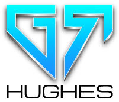

<h1 align="Center"></h1>

# Gary Hughes Portfolio

Milestone Project 1: User Centric Frontend Development - Code Institute

This is my portfolio website to present to potential employers and collaborators. It has been built with responsive design making it accessible and simple to navigate on a range of devices from mobile to desktop. On the homepage there is some general info about myself. My portfolio inlcudes a page with my resume where you can find out about my education, work history and skill set. You can find examples of my work on GitHub via a projects page and for those interested in collaboration, I can be contacted with any ideas you might have. Lastly, you can easily download a copy of my CV from my website.

[View my project live, here](https://gazroh87.github.io/GRHUGHES-Portfolio/)

## UX (User Experience)

- Does this fit my users needs?
- Does the user like my website?
- Does the user like being at my website?
- Is this a website a user might want to return to in the future?

These are all questions I asked myself throughout the UX process.

### User Stories

1. As an employer, I want to see what Gary is capable of doing as software developer by seeing examples of his work, so that I have an idea if he is a good fit for my available position within our company.
2. As a software development collaborator, I want an easy and appropriate way of contacting Gary with my collaboration idea, so that we can work together on something.
3. As a software development student, I'm looking for design ideas and inspiration for my own project, so that I can do well in my course.
4. As a recruitment agent, I want to see a broader overview of Gary by seeing his full resume and I expect to be able to easily download a copy of his CV for my records, so that I can determine whether Gary can be shortlisted for any of the available positions I need to fill.

### Design choices

#### Colour Scheme

- Shades of blue are used for the navbar text, heading text and buttons. White boxes form the areas of content with primarily black text and sit on top a black background for the whole website. Bright orange provides the accent and outlines.

#### Typography

- Michroma and Roboto are the main fonts used throughout the website, with Sans Serif as the fallback font if for some reason the main fonts can't be imported into the site correctly. Both of these fonts are very popular in the developer world and are also very easy to read, so they are both attractive and appropriate. Michroma is used for the larger headings and menus, and Roboto is used for the remaining text.

#### Imagery

- I decided to include large hero images which closely relate to the content of the page they occupy, whilst trying to fit my website's colour scheme. These combine with the fonts and colours to produce a modern and attractive looking design.

### Strategy

The focus of this project is I’m an unemployed software development student looking for work opportunities, collaboration ideas, contract work, and working with startups. First I need an online resume, an online presence for me and a place to showcase my work.
I have listed my opportunities to include in my website and rated each on a scale of 1 to 5 in terms of importance and viability or feasibility to determine what I will include in my first deployment and what will be left out atleast for the time being. For me , creating a minimal online presence is the primary goal followed by displaying a work portfolio. Increasing GitHub followers is the least important opportunity and is not really viable at the moment.

### Scope

It's important to provide employers and recruiting agents with a brief overview of myself and my capabilities. This way, they are able to get a look at who I am, my background, work I've done, and my skill set, and they have the option to contact me at their choosing.

### Structure

My website consists of 4 pages all easily accessible from the navbar on larger screen sizes or toggler "_hamburger_" button on smaller screen sizes. All external links, including links to my projects and social media, open in separate tabs so the flow is not disturbed. On larger screen sizes the navigation stays fixed to the top of the page even during scrolling. All text and content has been positioned from left to right and top to bottom in terms of implortance. The title of the active page in the navigation appears a darker shade of blue than the inactive pages in a subtle way of letting the user know where they within the website. My name logo is positioned to the left of the navbar and when clicked on will return the user back to the homepage. Each page title when hovered over will appear highlighted and underlined in orange to visualise to the user that this is a "_clickable_" action.

1. The Home / Landing page consists of a Hero image, a "Personal Info" section and an "About Me" section telling the user what they can expect from me, how I go about it, why they should hire me and what I do for fun.
2. The Resume page consists of a Hero image, a button link to download my CV, my skill set relating to coding and separate timelines displaying my education / training and work history.
3. The Projects page consists of a Hero image and a gallery of recent coding projects with links to the GitHub repositories.
4. The Collaboration page consists of a Hero image and a contact form providing user interaction with myself.

### Skeleton

#### Wireframes

Listed below are the desktop and mobile wireframes for each page of my website, created with the Balsamiq Wireframes application. These were created to show the planned differences in appearance and navigation between large and small screen sizes, but please note that they do not reflect a 100% replicated end result of my website and were only used as an original concept design to get each pages layout started.

1. Home Page Wireframes - [Click to View](https://github.com/Gazroh87/GRHUGHES-Portfolio/blob/master/wireframes/home_wireframe.png)
2. Resume Page Wireframes - [Click to View](https://github.com/Gazroh87/GRHUGHES-Portfolio/blob/master/wireframes/resume_wireframe.png)
3. Projects Page Wireframes - [Click to View](https://github.com/Gazroh87/GRHUGHES-Portfolio/blob/master/wireframes/projects_wireframe.png)
4. Collaboration Page Wireframes - [Click to View](https://github.com/Gazroh87/GRHUGHES-Portfolio/blob/master/wireframes/collaboration_wireframe.png)

### Surface

Predominantly mono colors were chosen for the backdrop with splashes of color giving an extra pop to create a modern and attractive look.

## Current Features

- Responsive on all device sizes makes the website easily accessible and simple to navigate.
- Interactive elements.

2. Home Page - The Personal Info section provides the user with my contact information and you can see what I look like. The about me section includes three reasons why the user and I should work together and an extra box of text letting the user know a little bit about my personal lifestyle outside of work.
3. Resume Page - The user can find a button to download my CV in pdf format, browse my skill set relating to web development with button links to find out more about each if they are unfamiliar. Further down the user can view timelines of my education/training and work history.
4. Projects Page - The user can browse my recent projects with an overview image and button link to the GitHub repository for each project.
5. Collaboration Page - The user with a collaboration idea can use the contact form, submitting their name, email address and message, with a button to request any interest or assistance.

### Features Left to Implement

In future, I would like to expand the skill set section with newly aquired skills as I progress through my course and more projects I hope to work on to create a more comprehensive display of my work. I would also like to include more animation techniques with elements and use JavaScript.

## Technologies Used

### Languages Used

- [HTML5](https://en.wikipedia.org/wiki/HTML5) - The main language used to build the basic layout of each page.
- [CSS3](https://en.wikipedia.org/wiki/Cascading_Style_Sheets) - This language is used for styling and formatting the base HTML code to personalise my pages.

### Frameworks, Libraries & Programs Used

1. [Bootstrap 4.5.0 Framework](https://getbootstrap.com/docs/4.5/getting-started/introduction/)

- The Bootstrap framework was used behind the existing HTML and CSS as the core structuring method of the website, using a grid system of rows and columns. This produces responsive and mobile-first design.

2. [Hover.css 2.3.1](https://ianlunn.github.io/Hover/)

- Hover.css was used on static icons throughout the website to add some animation to them while they are hovered over.

3. [Google Fonts](https://fonts.google.com/)

- Google Fonts were used to embed and link the 'Michroma' and 'Roboto' fonts into all html pages for use throughout the website.

4. [Font Awesome 4.7.0](https://fontawesome.com/v4.7.0/)

- Font Awesome was used to provide the icons within the footer of all pages and all other icons throughout the website for aesthetic and UX design purposes.

5. [jQuery 3.5.1](https://jquery.com/)

- jQuery comes as part of the Boostrap framework and was used to provide responsive expandable and collapsable functionality to the navbar.

6. [Git](https://git-scm.com/) / [Gitpod](https://www.gitpod.io/)

- Git was used for version control by utilizing the Gitpod terminal to commit files to Git and Push them to GitHub.

7. [GitHub](https://github.com/Gazroh87/GRHUGHES-Portfolio)

- GitHub is used to store the projects code within a repository including all previous versions or commits of the project after being pushed from Gitpod and is used to host the deployed website for public viewing.

8. [Adobe Illustrator](https://www.adobe.com/uk/products/illustrator.html)

- Adobe Illustrator was used to create my logo at the top of this file and placed within the Hero image of my homepage, resizing and editing of photos for the website.

9. [tiny png](https://tinypng.com/)

- Tiny png was used to compress the images used throughtout the website to reduce data size, decreasing load times without sacrificing the integrity or quality of the original images.

10. [Google Chrome DevTools](https://developers.google.com/web/tools/chrome-devtools)

- The Chrome DevTools debugging program was used throughout the building of the website to quickly see any changes made to the website code visualised in a live browser tab. I'm able to test the responsiveness of all elements and CSS visual changes.

11. [Balsamiq Wireframes 4.0.47](https://balsamiq.com/)

- I downloaded and used the Balsamiq Wireframes desktop application to create all my [wireframes](https://github.com/Gazroh87/GRHUGHES-Portfolio/tree/master/wireframes) during the design process.

12. [Shutterstock](https://www.shutterstock.com/home)

- Shutterstock provides the stock hero imagery of my wesbite.

13. [Am I Responsive Design?](http://ami.responsivedesign.is/)

- The web application was used to generate screencaps of my lading page at different viewports and position them to form a static demo presentation of my website's responsiveness as can be seen towards the top of this file.

14. [htmlcolorcodes.com built by Dixon & Moe](https://htmlcolorcodes.com/)

- HTML color codes was used to choose my colour scheme and obtain the corresponding hex codes for each colour.

## Testing

The W3C Markup Validator and W3C CSS Validator Services were used to validate every page of my project to ensure there were no syntax errors in the project.

- [W3C Markup Validator](https://validator.w3.org/#validate_by_uri+with_options)

- [W3C CSS Validator](https://jigsaw.w3.org/css-validator/#validate_by_input+with_options) 

### User Story Testing

1. As an employer, I want to see what Gary is capable of doing as software developer by seeing examples of his work, so that I have an idea if he is a good fit for my available position within our company.

   1. Upon entering the website, the employer is greeted with a personal info section containing contact info and they can easily locate the navigation menu in the top right. Clicking or tapping on the 'Projects' link will take them to the Projects page.
   2. In the Projects page, the user can see an image and brief decription of each project and each project has a clickable link to take the user to the GitHub repository or live website in a separate browser tab.

2. As a software development collaborator, I want an easy and appropriate way of contacting Gary with my collaboration idea, so that we can work together on something.

   1. Upon entering the website, the user can easily locate the navigation menu in the top right. Clicking or tapping on the 'Collaboration' link will take them to the Collaboration page.
   2. In the Collaboration page, the user can fill out a simple contact form with their name, email address to be contacted back and a message with their collaboration idea.

      - All fields of the contact form are required as indicated to the user by an asterisk at the end of each placeholder text.
      - When the user tries to submit the contact form with any empty field, a message will pop up, telling the user to enter text into the required field(s).
      - When the user tries to submit the contact form with an incorrect email address, a message will pop up, telling the user that the text they entered into the field is invalid.
      - If all fields are entered as required and valid then upon submitting the form, the current page will reload.

3. As a software development student, I'm looking for design ideas and inspiration for my own project, so that I can do well in my course.

   - Upon entering the website, the student can easily locate the navigation menu in the top right. Clicking or tapping on any of the page links will take them to the relevant page they might want to look at.

4. As a recruitment agent, I want to see a broader overview of Gary by seeing his full resume and I expect to be able to easily download a copy of his CV for my records, so that I can determine whether Gary can be shortlisted for any of the available positions I need to fill.

   1. Upon entering the website, the user is greeted with 'personal info' and 'about me' sections providing contact information and reasons to hire me.
   2. The user can easily locate the navigation menu in the top right. Clicking or tapping on the 'Resume' link will take them to the Resume page.
   3. In the Resume page, the user can donwload a copy of my CV by clicking/tapping the link to open my CV in a pdf file in a new browser tab.
   4. They can view my skill set in relation to coding and education, training and work history timelines.

### Further Testing

- Throughout the building prcoess of the website, I conducted regular testing through the use of Google Chrome DevTools (with Chrome being my default and primary browser used for this project).
- Beginning from the mobile-first perspective, every element of each page was tested to ensure they appear and function as desired and expected. When enabling the DevTools Inspector and toggling the device toolbar I was able to select specific device screen screen sizes or an unlimited responsive option for testing purposes.
- The website has been tested across multiple other popular web browsers including Mozilla Firefox, Microsoft Edge, Internet Explorer 11 and Apple Safari and tested on a variety of devices including iPhone 6S, iPhone X, iPad 2, laptop and desktop.
- A large amount of testing was done to ensure that all pages were linking correctly.
- I asked my partner to review my website at different developmental stages and the completed product across multiple device sizes for feedback and to point out any obvious bugs or issues with her user experience.
- Whenever I encountered something not appearing or functioning as it should, I would first try to rectify the problem with the DevTools elements panel by applying a fix. If this fix was successful, it would be replicated in Gitpod. If the fix was unsuccessful, my attention would turn to online resource(s) or Slack, to help identify why the problem is occuring, if there are any underlying issues and work-arounds or asking for advice to tackle the problem.

### Bugs Encountered

Below are some bugs I have encountered during testing and fixed:

Bug: Invisible text was showing instead of placeholder text in the message field of the contact form on the collaboration page.
Fix: The textarea element has been restricted to occupy one line of code to remove any conflicting spaces.

Bug: Too much empty space on both sides of container content and elements too small at larger screen widths.
Fix: Added media queries for larger screen widths up to 4K resolution and replaced hero images with larger sizes to match and prevent blurring/stretching.

Bug: Timelines were overlapping the container area at larger screen widths.
Fix: Added left margin to history-items class divs.

Bug: HTML files were not mappable to XML as described by the HTML validator because of extra hyphons within comments.
Fix: Removed the extra hyphons in comments.

## Deployment

My project was deployed directly from the master branch to GitHub Pages as the website host. Whenever new commits are made to the master branch the deployed site will update to the latest version. In order for the project to deploy successfully on GitHub Pages, the landing page has to remain as 'index.html'.

### GitHub Pages

I deployed my project to GitHub Pages using the following steps...

1. Log in to GitHub, locate Repositories then click on the repository [GRHUGHES-Portfolio](https://github.com/Gazroh87/GRHUGHES-Portfolio).
2. Locate the "Settings" button at the end of the horizontal menu and click to go to the settings page.
3. Scroll down the settings page until you find the "GitHub Pages" section.
4. Under "Source", click on the dropdown menu, set as "None" by deafult and change it to "master branch" from the available list of options.
5. The page will automatically reload, with a ribbon notification stating: "GitHub Pages source saved" indicating a successful deployment.
6. Above "Source", click the link next to "Your site is published at [https://gazroh87.github.io/GRHUGHES-Portfolio/](https://gazroh87.github.io/GRHUGHES-Portfolio/)".

### Making a Local Clone

To run this repository locally, you can clone this repository directly into the editor of your choice by pasting `git clone https://github.com/Gazroh87/GRHUGHES-Portfolio.git` into your terminal and hit 'Enter'. To cut ties with this GitHub repository, type `git remote rm origin` into the terminal and hit 'Enter'.

## Credits

### Code

### Content

### Media

### Acknowledgements
