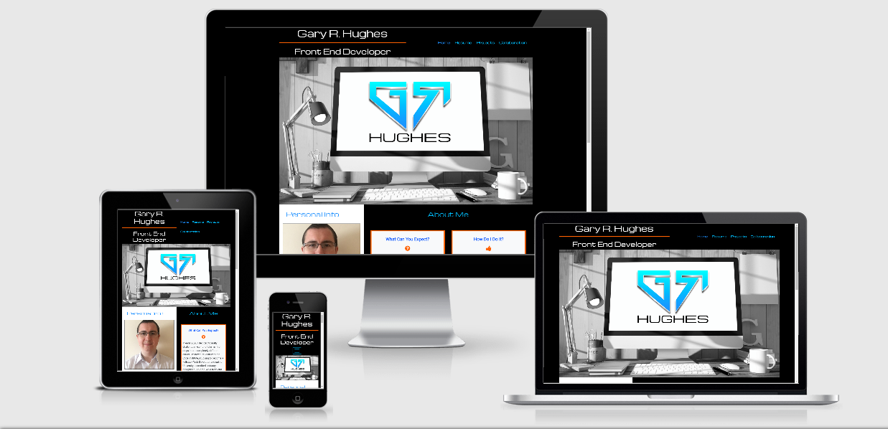

<h1 align="Center"></h1>

# Gary Hughes Portfolio

Milestone Project 1: User Centric Frontend Development - Code Institute

![Responsive Demo]

This is my portfolio website to present to potential employers and collaborators. It has been built with responsive design making it accessible and simple to navigate on a range of devices from mobile to desktop. On the homepage there is some general info about myself. My portfolio inlcudes a page with my resume where you can find out about my education, work history and skill set. You can find examples of my work on GitHub via a projects page and for those interested in collaboration, I can be contacted with any ideas you might have. Lastly, you can easily download a copy of my CV from my website.

[View my project live, here](https://codeinstitute.net)

## UX (User Experience)

- Does this fit my users needs?
- Does the user like my website?
- Does the user like being at my website?
- Is this a website a user might want to return to in the future?

These are all questions I asked myself throughout the UX process.

### User Stories

- As an employer, I want to see what Gary is capable of doing as software developer by seeing examples of his work, so that I have an idea if he is a good fit for my available position within our company.
- As a software development collaborator, I want an easy and appropriate way of contacting Gary with my collaboration idea, so that we can work together on something.
- As a software development student, I'm looking for design ideas and inspiration for my own project, so that I can do well in my course.
- As a recruitment agent, I want to see a broader overview of Gary by seeing his full resume and I expect to be able to easily download a copy of his CV for my records, so that I can determine whether Gary can be shortlisted for any of the available positions I need to fill.

### Design choices

#### Colour Scheme

- Shades of blue are used for the navbar text, heading text and buttons. White boxes form the areas of content with primarily black text and sit on top a black background for the whole website. Bright orange provides the accent and outlines.

#### Typography

- Michroma and Roboto are the main fonts used throughout the website, with Sans Serif as the fallback font if for some reason the main fonts can't be imported into the site correctly. Both of these fonts are very popular in the developer world and are also very easy to read, so they are both attractive and appropriate. Michroma is used for the larger headings and menus, and Roboto is used for the remaining text.

#### Imagery

- I decided to include large hero images which closely relate to the content of the page they occupy, whilst trying to fit my website's colour scheme. These combine with the fonts and colours to produce a modern and attractive looking design.

### Strategy

The focus of this project is I’m an unemployed software development student looking for work opportunities, collaboration ideas, contract work, and working with startups. First I need an online resume, an online presence for me and a place to showcase my work.
I have listed my opportunities to include in my website and rated each on a scale of 1 to 5 in terms of importance and viability or feasibility to determine what I will include in my first deployment and what will be left out atleast for the time being. For me , creating a minimal online presence is the primary goal followed by displaying a work portfolio. Increasing GitHub followers is the least important opportunity and is not really viable at the moment.

### Scope

It's important to provide employers and recruiting agents with a brief overview of myself and my capabilities. This way, they are able to get a look at who I am, my background, work I've done, and my skill set, and they have the option to contact me at their choosing.

### Structure

My website consists of 4 pages all easily accessible from the navbar on larger screen sizes or toggler "_hamburger_" button on smaller screen sizes. All external links, including links to my projects and social media, open in separate tabs so the flow is not disturbed. On larger screen sizes the navigation stays fixed to the top of the page even during scrolling. All text and content has been positioned from left to right and top to bottom in terms of implortance. The title of the active page in the navigation appears a darker shade of blue than the inactive pages in a subtle way of letting the user know where they within the website. My name logo is positioned to the left of the navbar and when clicked on will return the user back to the homepage. Each page title when hovered over will appear highlighted and underlined in orange to visualise to the user that this is a "*clickable*" action.

1. The Home / Landing page consists of a Hero image, a "Personal Info" section and an "About Me" section telling the user what they can expect from me, how I go about it, why they should hire me and what I do for fun.
2. The Resume page consists of a Hero image, a button link to download my CV, my skill set relating to coding and separate timelines displaying my education / training and work history.
3. The Projects page consists of a Hero image and a gallery of recent coding projects with links to the GitHub repositories.
4. The Collaboration page consists of a Hero image and a contact form providing user interaction with myself.

### Skeleton

#### Wireframes

Listed below are the desktop and mobile wireframes for each page of my website, created with the Balsamiq Wireframes application. These were created to show the planned differences in appearance and navigation between large and small screen sizes, but please note that they do not reflect a 100% replicated end result of my website and were only used as an original concept design to get each pages layout started.

1. Home Page Wireframes - [Click to View](https://github.com/Gazroh87/GRHUGHES-Portfolio/blob/master/wireframes/home_wireframe.png)
2. Resume Page Wireframes - [Click to View](https://github.com/Gazroh87/GRHUGHES-Portfolio/blob/master/wireframes/resume_wireframe.png)
3. Projects Page Wireframes - [Click to View](https://github.com/Gazroh87/GRHUGHES-Portfolio/blob/master/wireframes/projects_wireframe.png)
4. Collaboration Page Wireframes - [Click to View](https://github.com/Gazroh87/GRHUGHES-Portfolio/blob/master/wireframes/collaboration_wireframe.png)

### Surface

## Current Features

- Responsive on all device sizes makes the website easily accessible and simple to navigate.
- Interactive elements.

### Features Left to Implement

## Technologies Used

### Languages Used

- [HTML5](https://en.wikipedia.org/wiki/HTML5)
- [CSS3](https://en.wikipedia.org/wiki/Cascading_Style_Sheets)

### Frameworks, Libraries & Programs Used

1. [Bootstrap]
2. []
3. []
4. []
5. []
6. []
7. []
8. []
9. []
10. []

## Testing

### User Story Testing

### Further Testing

### Known Bugs

## Deployment

### GitHub Pages

## Credits

### Code

### Content

### Media

### Acknowledgements
